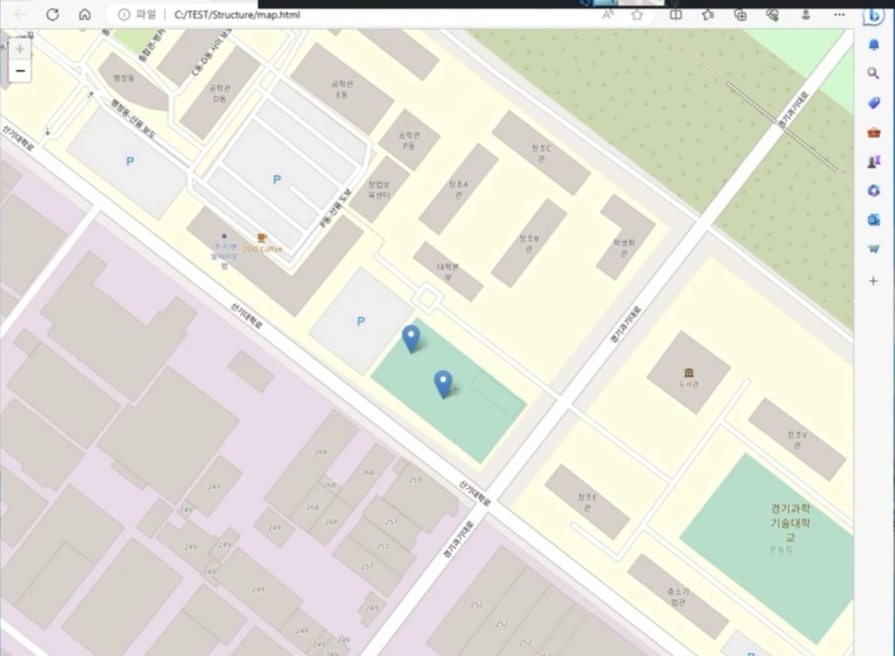

### 사용 라이브러리

- mqtt : 최소한의 전력과 패킷량으로 통신하기 위해 사용
- tkinter : 소방서의 기능을 GUI를 통해 시각화하기 위해 사용
- folium : 신고 앱으로 부터 전송받은 위치 정보를 지도에 표현하기 위해 사용
- haversine : 신고받은 위치와 소방서 위치의 거리를 측정하기 위해 사용
- geocoder : 신고받은 위치의 정보(위도, 경도)를 통해 주소를 텍스트 형태로 불러오기 위해 사용

신고 접수 전

신고 접수 후

신고 접수 후 맵을 통한 시각화
